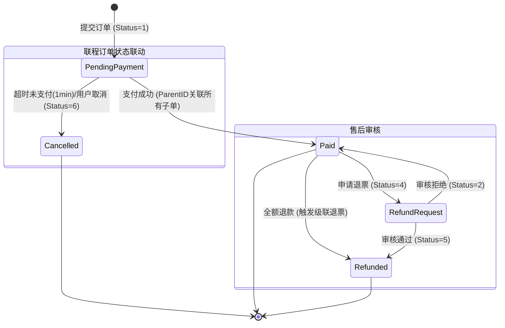

# ✈️ SkyLink Backend - 分布式航空订票系统

## 📝 更新日志 (Changelog)
- 2025-12-23
  - 订单状态机重构：移除“创建审核”环节，下单即“待支付(1)”。
  - 支付策略调整：支付窗口缩短为 **1分钟**，超时自动取消(6)并释放座位。
  - 接口治理：合并审核接口，仅保留管理端 `/api/v1/admins/orders/{orderId}/audits` 用于退改签审核。
  - 异常提示优化：全面替换技术性报错为用户友好的中文提示。
  - 订单创建：切换至 Mode B“下单即隐式锁座，支付后可选座”
  - 座位服务：新增单座操作接口（锁、释、确、换）
  - 数据库：为 `orders` 表新增 `seat_id` 字段

SkyLink 是一个基于 **Spring Boot 4** 和 **MyBatis-Plus** 构建的高性能分布式航空订票系统后端。支持航班搜索、智能联程拼接、分布式事务订单处理、支付对接以及完整的后台管理功能。

本项目集成了 **ShardingSphere** 进行分库分表，并采用 **RESTful** 风格设计 API，旨在提供稳定、高效的航空业务支撑。

---

## 📚 目录 (Table of Contents)

- [核心特性 (Features)](#-核心特性-features)
- [技术栈 (Tech Stack)](#-技术栈-tech-stack)
- [系统架构 (Architecture)](#-系统架构-architecture)
- [前端对接指南 (Frontend Integration)](#-前端对接指南-frontend-integration)
- [API 接口文档 (API Documentation)](#-api-接口文档-api-documentation)
  - [公共/用户接口](#1-公共用户接口-publicuser-apis)
  - [管理后台接口](#2-管理后台接口-admin-apis)
  - [选座接口](#3-选座接口-seat-apis)
- [快速开始 (Getting Started)](#-快速开始-getting-started)
- [异常处理与状态码](#-异常处理与状态码)

---

## 🌟 核心特性 (Features)

### 🛫 航班业务
- **智能联程搜索**：支持跨航段拼接，自动计算中转时间与总价。
- **动态定价**：基于航线基础价 × 舱位系数自动计算最低票价。
- **自动座位生成**：根据机型配置自动生成 `行号+列字母` (如 1A, 12F) 的座位布局。

### � 智能中转机制 (Smart Interline)
系统内置基于内存拼接的"Split-Join"算法，实现高效的中转方案推荐：
1. **双向检索**：同时查询`出发地->X`和`X->目的地`的航班集合。
2. **内存匹配**：在应用层计算中转组合，强制约束 **2h ≤ 中转间隔 ≤ 24h**，确保行程合理。
3. **原子交易**：
   - **库存预占**：联程下单时，通过 `seatService.lockSeatsBatch` 对多段航班进行原子化锁座。
   - **事务一致**：任一段失败（如库存不足）则全单回滚，保障"同买同退"。
   - **数据关联**：生成统一 `parent_order_id` 关联多条子订单，支持一键支付全路段。

### � 订单交易
- **分布式事务**：保障联程订单（多航段）的数据一致性，任一段失败自动回滚。
- **并发控制**：基于 Redis/DB 锁机制防止库存超卖。
- **状态机管理**：完整的订单生命周期（待审核 -> 待支付 -> 已支付/已取消/已退款）。

### 🛡️ 系统与安全
- **RBAC 权限模型**：区分普通用户、普通管理员、超级管理员。
- **数据分片**：集成 ShardingSphere-Proxy 处理海量业务数据。
- **操作审计**：全量记录管理员操作日志。

---

## 🛠 技术栈 (Tech Stack)

| 类别 | 技术/组件 | 说明 |
| --- | --- | --- |
| **Language** | Java 21 | 最新 LTS 版本 |
| **Framework** | Spring Boot 4.0 | 核心应用框架 |
| **ORM** | MyBatis-Plus 3.5.15 | 持久层框架，Lambda 风格调用 |
| **Database** | MySQL 9.3 | 关系型数据库 |
| **Sharding** | ShardingSphere-Proxy | 分库分表中间件 |
| **Docs** | SpringDoc OpenAPI | 自动生成 Swagger 文档 |
| **Build** | Maven | 项目构建工具 |

---

## 🏗 系统架构 (Architecture)

### 1. 模块交互图
```mermaid
graph TD
    User[用户/客户端] --> SearchService[航班搜索服务]
    User --> BookingService[下单服务]
    
    subgraph Core[核心业务层]
        SearchService --> Strategy[中转拼接策略]
        Strategy --> Cache[Redis缓存 (热门中转)]
        BookingService --> Transaction[分布式事务管理]
        Transaction --> Lock[库存锁]
    end
    
    subgraph Data[数据层]
        SearchService --> FlightDB[(航班数据库)]
        BookingService --> OrderDB[(订单数据库)]
        Lock --> Inventory[(库存表)]
    end
    
    OrderDB --> StateMachine[状态机联动]
    StateMachine --> RefundService[退改服务]
```

### 2. 订单状态流转


---

## 💻 前端对接指南 (Frontend Integration)

### 1. 统一响应格式
所有接口均返回统一的 JSON 结构：
```json
{
  "code": 0,
  "msg": "success",
  "data": { ... }
}
```

### 1.1 分页响应规范
- 列表类接口统一返回 `PageResult`：
```json
{
  "code": 0,
  "msg": "success",
  "data": {
    "total": 123,     // 总记录数
    "data": [ ... ]   // 当前页数据数组
  }
}
```
- 通用分页参数：`page` (默认 1), `size` (默认 20，最大建议 100)。
  - 页码从 1 开始；后端使用 `offset = (page - 1) * size` 做物理分页。
  - 异常返回时 `code != 0`，`msg` 为具体错误信息（如 404 订单不存在、409 状态冲突等）。

### 2. 认证鉴权 (Headers)

| 角色 | Header Key | Header Value | 说明 |
| --- | --- | --- | --- |
| **所有已登录用户** | `Authorization` | `Bearer <token>` | 登录接口返回的 Token |
| **管理员 (必须)** | `X-User-Type` | `2` | 标识当前请求为管理员操作 |
| **管理员 (权限)** | `X-Admin-Role` | `1` 或 `2` | `1`: 普通管理员, `2`: 超级管理员 |

> ⚠️ **注意**：管理员调用接口时，除了 `Authorization` 外，**必须**同时携带 `X-User-Type` 和 `X-Admin-Role`，否则会报 403 错误。

### 3. 基础环境
- **Base URL**: `http://localhost:9999`
- **Swagger UI**: `http://localhost:9999/swagger-ui/index.html`

### 4. 联程/转机业务对接 (Interline Integration)

**场景**: 用户搜索 "A -> C"，系统返回 "A -> B" + "B -> C" 的组合方案。

**Step 1: 展示搜索结果**
- **API**: `GET /api/v1/flights`
- **数据源**: 响应体中的 `data.interlineFlights` 数组。
- **展示逻辑**:
  - 外层卡片：显示总价 (`totalPrice`)、总时长、中转城市 (`transferCity`)。
  - 详情展开：遍历 `segments` 数组，展示每一程的航班号、起降时间。
  - **关键校验**: 确保第二程的起飞时间晚于第一程的到达时间（后端已过滤，前端可二次确认）。

**Step 2: 提交下单 (Booking)**
- **API**: `POST /api/v1/orders`
- **Payload 构造**:
  - 将所有航段的 `flightNo` 按顺序放入 `flightNos` 数组。
  - 示例:
    ```json
    {
      "userId": 1001,
      "flightNos": ["MU5588", "CA1818"], // 核心：传递多段航班号
      "cabinType": "ECONOMY",
      "ticketNum": 1,
      "passengerName": "Alice",
      "contactPhone": "13900000000"
    }
    ```

**Step 3: 结果处理**
- **成功**: 返回 `200`，`data` 中包含 `orderNo`（首个子订单的 `orderId`，后续支付/取消/选座等操作均以该值作为路径参数）与 `orderStatus: 1`（待支付）。
  - 若为联程/多乘客场景：`data.parentOrderId` 会提供联程关联用的 `parent_order_id`。
- **注意**: 请提示用户在 **1分钟** 内完成支付，否则订单将自动取消。
- **失败**: 
  - `4001`: 库存不足 (任一段无票即全单失败)。
  - `4002`: 中转时间非法 (后端二次校验)。

---

## 📖 API 接口文档 (API Documentation)

### 1. 公共/用户接口 (Public/User APIs)

#### 🔐 认证 (Auth)
- **用户登录**: `POST /api/v1/users/sessions`
  - Body: `{ "phoneNumber": "...", "password": "..." }`
- **用户注册**: `POST /api/v1/users`
  - Body: `{ "phoneNumber": "...", "password": "...", "realName": "..." }`

#### ✈️ 航班 (Flights)
- **搜索航班**: `GET /api/v1/flights`
  - Params: `departurePlace`, `destination`, `departureDate`
  - 分页: `page` (默认1), `size` (默认20)
  - Response: 包含直飞 (`directFlights`) 和联程 (`interlineFlights`) 列表。
- **座位列表**: `GET /api/v1/flights/{flightId}/seats`
  - Path: `flightId`
  - Query: `cabinType`（可选，用于过滤舱位）
  - Response: `200` 返回数组元素包含（核心字段）：
    - `seatId`, `flightId`, `cabinType`, `seatNumber`
    - `rowNumber`, `columnLetter`（由 `seatNumber` 解析得到）
    - `status`：`1=可用, 2=已售, 3=锁定`
    - 兼容字段：`statusText`（AVAILABLE/OCCUPIED/RESERVED/MAINTENANCE）、`classType`
  - 价格计算: 航线基础价 × 舱位系数

#### 📦 订单 (Orders)
- **创建订单 (支持单程/联程)**: `POST /api/v1/orders`
  - **支持多航段**：通过 `flightNos` 数组传递多个航班号。
  - Body:
    ```json
    {
      "userId": 1001,
      "flightNos": ["MU1234", "CA5678"], // 联程时传多个，单程传一个
      "cabinType": "ECONOMY",
      "passengerName": "John Doe",
      "contactPhone": "13800138000"
    }
    ```
- **查询订单**: `GET /api/v1/orders`
  - Params: `userId`, `orderNo`, `orderStatus`, `createTimeStart`, `createTimeEnd`, `flightNo`, `cabinType`, `page`(默认1), `size`(默认20)
  - Response: `PageResult<OrderSearchResponse>`
- **订单选座**: `PUT /api/v1/orders/{orderId}/seat`
  - Path: `orderId`
  - Body:
    ```json
    { "seatId": 12345 }
    ```
    > 兼容：也接受 `{ "newSeatId": 12345 }`（历史口径）
  - Response: `200` 返回更新后的 `OrderSearchResponse`
  - 规则:
    - 仅可选择 `AVAILABLE` 座位
    - 必须与订单舱位类型一致
    - 并发控制：原子条件更新保证一次只成功一个选择
- **我的订单**: `GET /api/v1/orders/my`
  - Params: `userId` (固定用户ID，例如 `${user_id}`)
  - 规则：仅返回有效订单（状态不为 0，且未被自动清理），按 `orderTime` 降序
  - 返回字段：与 `OrderSearchResponse` 一致，包含 `orderNo`、`flightNo`、`passengerName`、`contactEmail`、`contactPhone`、`passengersJson`、`orderStatus`、`totalAmount`、`orderTime`、`payTime`、`refundTime`、`changeTime`、`origin`、`destination`、`departureTime`、`arrivalTime`

#### 💳 支付 (Payments)
- **查询支付记录**: `GET /api/v1/payments`
  - Params: `orderNo`, `userId`, `paymentStatus`, `paymentMethod`, `paymentTimeStart`, `paymentTimeEnd`, `page`(默认1), `size`(默认20)
  - Response: `PageResult<PaymentSearchResponse>`
  - 说明：当传入 `userId` 时，将按该用户的订单进行关联查询

### 3. 前端分页对接示例

#### 3.1 订单列表（按用户ID筛选）
请求示例：
```http
GET /api/v1/orders?userId=1001&page=1&size=20
Authorization: Bearer <token>
```
响应示例：
```json
{
  "code": 0,
  "msg": "success",
  "data": {
    "total": 57,
    "data": [
      {
        "orderNo": "123456789012345678",
        "flightNo": "MU5588",
        "passengerName": "Alice",
        "contactEmail": "alice@example.com",
        "contactPhone": "13900000000",
        "orderStatus": 1,
        "totalAmount": 1999.00,
        "orderTime": "2025-12-24T10:01:00",
        "payTime": null,
        "refundTime": null,
        "changeTime": null,
        "origin": "Beijing",
        "destination": "Shanghai",
        "departureTime": "2025-12-25T08:30:00",
        "arrivalTime": "2025-12-25T10:45:00"
      }
    ]
  }
}
```
前端处理要点：
- 读取 `data.total` 计算总页数：`const totalPages = Math.ceil(total / size)`
- 列表数据为 `data.data`，非顶层数组
- 页码从 1 开始；切页时传递 `page` 与 `size`

#### 3.2 支付记录列表（按订单号筛选）
请求示例：
```http
GET /api/v1/payments?orderNo=123456789012345678&page=2&size=20
Authorization: Bearer <token>
```
响应示例：
```json
{
  "code": 0,
  "msg": "success",
  "data": {
    "total": 3,
    "data": [
      {
        "paymentId": "8888888888",
        "orderNo": "123456789012345678",
        "paymentAmount": 1999.00,
        "paymentMethod": "ALIPAY",
        "paymentStatus": 1,
        "tradeNo": "TRADE-2025-xxxx",
        "paymentTime": "2025-12-24T10:05:00",
        "refundTime": null
      }
    ]
  }
}
```

### 4. 选座对接示例

#### 4.1 查询航班座位
请求：
```http
GET /api/v1/flights/1001/seats
Authorization: Bearer <token>
```
响应：
```json
[
  {
    "seatId": 5001,
    "seatNumber": "12A",
    "status": "AVAILABLE",
    "classType": "ECONOMY",
    "price": 999.00
  }
]
```

#### 4.2 订单选座
请求：
```http
PUT /api/v1/orders/888888/seat
Authorization: Bearer <token>
Content-Type: application/json

{ "seatId": 5001 }
```
成功响应：
```json
{
  "code": 0,
  "msg": "success",
  "data": {
    "orderNo": "888888",
    "flightNo": "MU5588",
    "orderStatus": 1,
    "payTime": null
  }
}
```
失败示例（座位已被占用）：
```json
{ "code": 409, "msg": "座位不可选或已被占用", "data": null }
```

#### 3.3 前端分页伪代码
```ts
async function fetchOrders({ page = 1, size = 20, filters }) {
  const qs = new URLSearchParams({ page: String(page), size: String(size), ...filters });
  const res = await fetch(`/api/v1/orders?${qs.toString()}`, { headers: { Authorization: `Bearer ${token}` } });
  const json = await res.json();
  if (json.code !== 0) throw new Error(json.msg);
  return {
    items: json.data.data,
    total: json.data.total,
    page,
    size
  };
}
```

### 2. 管理后台接口 (Admin APIs)
> **Base Path**: `/api/v1/admins`
> **Required Headers**: `X-User-Type: 2`, `X-Admin-Role: <role>`

#### 🖥 管理员会话
- **管理员登录**: `POST /api/v1/admins/sessions`
  - Body: `{ "adminAccount": "admin", "password": "..." }`
  - Returns: `token`, `adminRole` (前端需保存这两个值用于后续请求)

#### ✈️ 航班管理
- **创建航班**: `POST /api/v1/admins/flights`
  - 自动计算最低价、自动生成座位。
- **修改航班**: `PUT /api/v1/admins/flights/{id}`
  - 修改机型会触发座位重置。

#### ✅ 订单审核
- **管理员审核通过/拒绝**: `POST /api/v1/admins/orders/{orderId}/audits`
  - Body: `{ "pass": true | false }`
  - 逻辑：仅处理状态为 `4` (退票/改签申请中) 的订单。
  - 结果：通过 -> 状态变更为 `5` (已退款)；拒绝 -> 状态回滚为 `2` (已确认)。
  - 联程订单：审核任一段将级联更新同一 `parentOrderId` 下的所有子单

---

## 🚀 快速开始 (Getting Started)

### 环境要求
- JDK 21+
- Docker & Docker Compose（用于 MySQL + ShardingSphere Proxy）

> 数据库与代理推荐按仓库根目录 README 的方式启动：[../README.md](../README.md)

### 启动

```bash
./mvnw spring-boot:run
```

默认地址：`http://localhost:9999`

验证：

```bash
curl http://localhost:9999/api/v1/system/health
```

## 详细使用说明

### API 文档与约定

- Swagger UI：`http://localhost:9999/swagger-ui/index.html`
- 接口清单/枚举/错误码（建议作为联调权威来源）：[../API_AUDIT_REPORT.md](../API_AUDIT_REPORT.md)

### 统一响应结构

后端接口统一返回 `code/msg/data` 结构，且前端需要同时兼容：

- JSON `code`（优先）
- HTTP status（部分场景会同步设置为 400/401/403/409/500 等）

### 鉴权与权限（Header）

- 用户端：建议使用 `Authorization: Bearer <token>`（登录接口返回）；也兼容 `X-User-Id` 回退方案（开发/测试用途）。
- 管理端：通常需要 `X-User-Type: 2`；部分操作还需要 `X-Admin-Role: 2`。

## 核心能力说明

### 联程（Interline）

- 支持 Split-Join 拼接联程方案
- 约束中转时间：$2h \le \Delta t \le 24h$

### Mode B（下单锁座、支付后可换座）

- 下单阶段可锁定座位并写入订单 `seat_id`
- 支付成功后确认座位为已售
- 支付后可换座（原子换座，冲突时失败）

### 订单超时自动取消

- 通过定时任务扫描待支付订单并取消，同时释放座位
- 具体超时窗口与扫描频率以代码与系统配置为准（任务实现位置：`module/order/task/OrderTimeoutTask`）

## 贡献指南

1. 新建分支：`git checkout -b feature/<topic>`
2. 提交前自测：`./mvnw test`
3. 提交信息包含：模块 + 目的 + 影响范围
4. PR 描述包含：验证步骤、接口变更（如有）、兼容性说明

## 许可证

本仓库当前未包含 LICENSE 文件，因此不授予任何开源许可。若需要开源发布，请先补充 LICENSE 并在此处更新说明。
