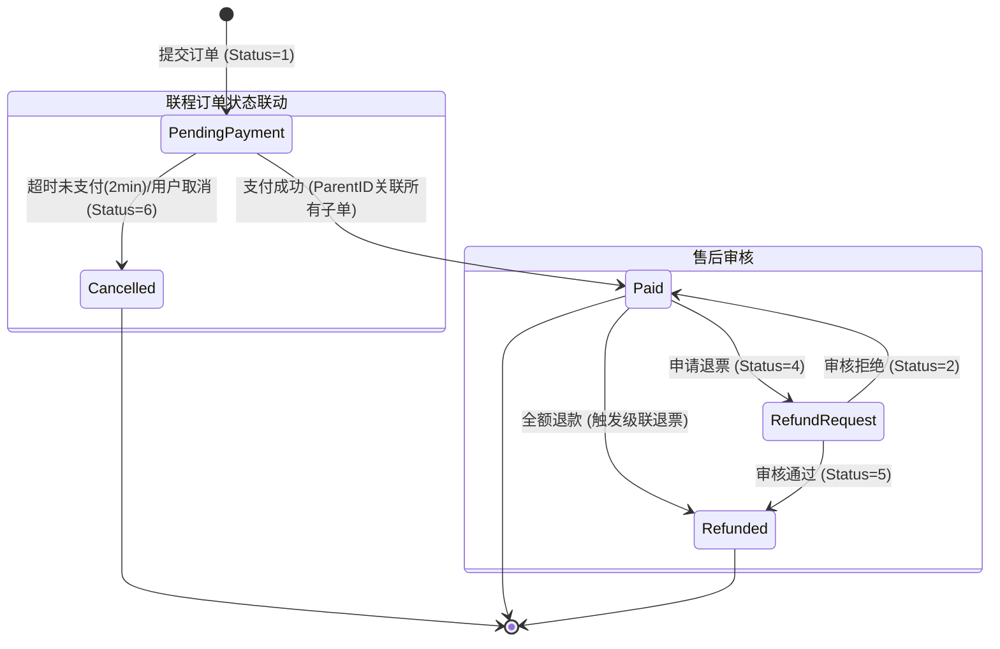

# ✈️ SkyLink Backend - 分布式航空订票系统

## 📝 更新日志 (Changelog)
- 2025-12-23
  - 订单状态机重构：移除“创建审核”环节，下单即“待支付(1)”。
  - 支付策略调整：支付窗口缩短为 **2分钟**，超时自动取消(6)并释放座位。
  - 接口治理：合并审核接口，仅保留管理端 `/api/v1/admins/orders/{orderId}/audits` 用于退改签审核。
  - 异常提示优化：全面替换技术性报错为用户友好的中文提示。
  - 订单创建：切换至 Mode B“下单即隐式锁座，支付后可选座”
  - 座位服务：新增单座操作接口（锁、释、确、换）
  - 数据库：为 `orders` 表新增 `seat_id` 字段

SkyLink 是一个基于 **Spring Boot 4** 和 **MyBatis-Plus** 构建的高性能分布式航空订票系统后端。支持航班搜索、智能联程拼接、分布式事务订单处理、支付对接以及完整的后台管理功能。

本项目集成了 **ShardingSphere** 进行分库分表，并采用 **RESTful** 风格设计 API，旨在提供稳定、高效的航空业务支撑。

---

## 📚 目录 (Table of Contents)

- [核心特性 (Features)](#-核心特性-features)
- [技术栈 (Tech Stack)](#-技术栈-tech-stack)
- [系统架构 (Architecture)](#-系统架构-architecture)
- [前端对接指南 (Frontend Integration)](#-前端对接指南-frontend-integration)
- [API 接口文档 (API Documentation)](#-api-接口文档-api-documentation)
  - [公共/用户接口](#1-公共用户接口-publicuser-apis)
  - [管理后台接口](#2-管理后台接口-admin-apis)
- [快速开始 (Getting Started)](#-快速开始-getting-started)
- [异常处理与状态码](#-异常处理与状态码)

---

## 🌟 核心特性 (Features)

### 🛫 航班业务
- **智能联程搜索**：支持跨航段拼接，自动计算中转时间与总价。
- **动态定价**：基于航线基础价 × 舱位系数自动计算最低票价。
- **自动座位生成**：根据机型配置自动生成 `行号+列字母` (如 1A, 12F) 的座位布局。

### � 智能中转机制 (Smart Interline)
系统内置基于内存拼接的"Split-Join"算法，实现高效的中转方案推荐：
1. **双向检索**：同时查询`出发地->X`和`X->目的地`的航班集合。
2. **内存匹配**：在应用层计算中转组合，强制约束 **2h ≤ 中转间隔 ≤ 24h**，确保行程合理。
3. **原子交易**：
   - **库存预占**：联程下单时，通过 `seatService.lockSeatsBatch` 对多段航班进行原子化锁座。
   - **事务一致**：任一段失败（如库存不足）则全单回滚，保障"同买同退"。
   - **数据关联**：生成统一 `parent_order_id` 关联多条子订单，支持一键支付全路段。

### � 订单交易
- **分布式事务**：保障联程订单（多航段）的数据一致性，任一段失败自动回滚。
- **并发控制**：基于 Redis/DB 锁机制防止库存超卖。
- **状态机管理**：完整的订单生命周期（待审核 -> 待支付 -> 已支付/已取消/已退款）。

### 🛡️ 系统与安全
- **RBAC 权限模型**：区分普通用户、普通管理员、超级管理员。
- **数据分片**：集成 ShardingSphere-Proxy 处理海量业务数据。
- **操作审计**：全量记录管理员操作日志。

---

## 🛠 技术栈 (Tech Stack)

| 类别 | 技术/组件 | 说明 |
| --- | --- | --- |
| **Language** | Java 21 | 最新 LTS 版本 |
| **Framework** | Spring Boot 4.0 | 核心应用框架 |
| **ORM** | MyBatis-Plus 3.5.15 | 持久层框架，Lambda 风格调用 |
| **Database** | MySQL 9.3 | 关系型数据库 |
| **Sharding** | ShardingSphere-Proxy | 分库分表中间件 |
| **Docs** | SpringDoc OpenAPI | 自动生成 Swagger 文档 |
| **Build** | Maven | 项目构建工具 |

---

## 🏗 系统架构 (Architecture)

### 1. 模块交互图
```mermaid
graph TD
    User[用户/客户端] --> SearchService[航班搜索服务]
    User --> BookingService[下单服务]
    
    subgraph Core[核心业务层]
        SearchService --> Strategy[中转拼接策略]
        Strategy --> Cache[Redis缓存 (热门中转)]
        BookingService --> Transaction[分布式事务管理]
        Transaction --> Lock[库存锁]
    end
    
    subgraph Data[数据层]
        SearchService --> FlightDB[(航班数据库)]
        BookingService --> OrderDB[(订单数据库)]
        Lock --> Inventory[(库存表)]
    end
    
    OrderDB --> StateMachine[状态机联动]
    StateMachine --> RefundService[退改服务]
```

### 2. 订单状态流转


---

## 💻 前端对接指南 (Frontend Integration)

### 1. 统一响应格式
所有接口均返回统一的 JSON 结构：
```json
{
  "code": 200,      // 200: 成功, 非200: 业务异常
  "msg": "success", // 提示信息
  "data": { ... }   // 业务数据
}
```

### 2. 认证鉴权 (Headers)

| 角色 | Header Key | Header Value | 说明 |
| --- | --- | --- | --- |
| **所有已登录用户** | `Authorization` | `Bearer <token>` | 登录接口返回的 Token |
| **管理员 (必须)** | `X-User-Type` | `2` | 标识当前请求为管理员操作 |
| **管理员 (权限)** | `X-Admin-Role` | `1` 或 `2` | `1`: 普通管理员, `2`: 超级管理员 |

> ⚠️ **注意**：管理员调用接口时，除了 `Authorization` 外，**必须**同时携带 `X-User-Type` 和 `X-Admin-Role`，否则会报 403 错误。

### 3. 基础环境
- **Base URL**: `http://localhost:9999`
- **Swagger UI**: `http://localhost:9999/swagger-ui/index.html`

### 4. 联程/转机业务对接 (Interline Integration)

**场景**: 用户搜索 "A -> C"，系统返回 "A -> B" + "B -> C" 的组合方案。

**Step 1: 展示搜索结果**
- **API**: `GET /api/v1/flights`
- **数据源**: 响应体中的 `data.interlineFlights` 数组。
- **展示逻辑**:
  - 外层卡片：显示总价 (`totalPrice`)、总时长、中转城市 (`transferCity`)。
  - 详情展开：遍历 `segments` 数组，展示每一程的航班号、起降时间。
  - **关键校验**: 确保第二程的起飞时间晚于第一程的到达时间（后端已过滤，前端可二次确认）。

**Step 2: 提交下单 (Booking)**
- **API**: `POST /api/v1/orders`
- **Payload 构造**:
  - 将所有航段的 `flightNo` 按顺序放入 `flightNos` 数组。
  - 示例:
    ```json
    {
      "userId": 1001,
      "flightNos": ["MU5588", "CA1818"], // 核心：传递多段航班号
      "cabinType": "ECONOMY",
      "ticketNum": 1,
      "passengerName": "Alice",
      "contactPhone": "13900000000"
    }
    ```

**Step 3: 结果处理**
- **成功**: 返回 `200`，`data` 中包含 `orderNo` (即 Parent Order ID) 和 `orderStatus: 1` (待支付)。
- **注意**: 请提示用户在 **2分钟** 内完成支付，否则订单将自动取消。
- **失败**: 
  - `4001`: 库存不足 (任一段无票即全单失败)。
  - `4002`: 中转时间非法 (后端二次校验)。

---

## 📖 API 接口文档 (API Documentation)

### 1. 公共/用户接口 (Public/User APIs)

#### 🔐 认证 (Auth)
- **用户登录**: `POST /api/v1/users/sessions`
  - Body: `{ "phoneNumber": "...", "password": "..." }`
- **用户注册**: `POST /api/v1/users`
  - Body: `{ "phoneNumber": "...", "password": "...", "realName": "..." }`

#### ✈️ 航班 (Flights)
- **搜索航班**: `GET /api/v1/flights`
  - Params: `departurePlace`, `destination`, `departureDate`
  - Response: 包含直飞 (`directFlights`) 和联程 (`interlineFlights`) 列表。

#### 📦 订单 (Orders)
- **创建订单 (支持单程/联程)**: `POST /api/v1/orders`
  - **支持多航段**：通过 `flightNos` 数组传递多个航班号。
  - Body:
    ```json
    {
      "userId": 1001,
      "flightNos": ["MU1234", "CA5678"], // 联程时传多个，单程传一个
      "cabinType": "ECONOMY",
      "passengerName": "John Doe",
      "contactPhone": "13800138000"
    }
    ```
- **我的订单**: `GET /api/v1/orders/my`
  - Params: `userId` (固定用户ID，例如 `${user_id}`)
  - 规则：仅返回有效订单（状态不为 0，且未被自动清理），按 `orderTime` 降序
  - 返回字段：与 `OrderSearchResponse` 一致，包含 `orderNo`、`flightNo`、`passengerName`、`contactEmail`、`contactPhone`、`passengersJson`、`orderStatus`、`totalAmount`、`orderTime`、`payTime`、`refundTime`、`changeTime`、`origin`、`destination`、`departureTime`、`arrivalTime`

### 2. 管理后台接口 (Admin APIs)
> **Base Path**: `/api/v1/admins`
> **Required Headers**: `X-User-Type: 2`, `X-Admin-Role: <role>`

#### 🖥 管理员会话
- **管理员登录**: `POST /api/v1/admins/sessions`
  - Body: `{ "adminAccount": "admin", "password": "..." }`
  - Returns: `token`, `adminRole` (前端需保存这两个值用于后续请求)

#### ✈️ 航班管理
- **创建航班**: `POST /api/v1/admins/flights`
  - 自动计算最低价、自动生成座位。
- **修改航班**: `PUT /api/v1/admins/flights/{id}`
  - 修改机型会触发座位重置。

#### ✅ 订单审核
- **管理员审核通过/拒绝**: `POST /api/v1/admins/orders/{orderId}/audits`
  - Body: `{ "pass": true | false }`
  - 逻辑：仅处理状态为 `4` (退票/改签申请中) 的订单。
  - 结果：通过 -> 状态变更为 `5` (已退款)；拒绝 -> 状态回滚为 `2` (已确认)。
  - 联程订单：审核任一段将级联更新同一 `parentOrderId` 下的所有子单

---

## 🚀 快速开始 (Getting Started)

### 环境要求
- JDK 21+
- Maven 3.8+
- MySQL 8.0+ (推荐 9.3)

### 安装步骤

1. **克隆项目**
   ```bash
   git clone https://github.com/your-repo/skylink-backend.git
   cd skylink-backend
   ```

2. **数据库初始化**
   - 执行 `Shardingsphere-proxy/mysql-init/01-init.sql` 初始化表结构。
   - 确保 `application.yml` 中的数据库连接配置正确。

3. **编译与运行**
   ```bash
   # 编译
   mvn clean package -DskipTests

   # 运行
   java -jar target/skylink-backend-0.0.1-SNAPSHOT.jar
   ```

4. **验证**
   访问 `http://localhost:9999/api/v1/system/health`，应返回 `Hello, SkyLink`。

---

## ⚠️ 异常处理与状态码

| 异常类型 | 错误码 | 触发场景 | 前端处理建议 |
| :--- | :--- | :--- | :--- |
| `InventoryShortageException` | **4001** | 库存不足 | 提示"余票不足"，引导重新搜索 |
| `InterlineTimeConflictException` | **4002** | 中转时间冲突 | 提示"中转时间不足"，禁止下单 |
| `SeatOccupiedException` | **4003** | 座位已被占用 | 刷新选座图，提示重选 |
| `PriceChangedException` | **4004** | 价格变动 | 弹窗提示最新价格，需用户确认 |
| `PartialBookingException` | **5001** | 部分航段失败 | 系统自动回滚，提示"系统繁忙" |

---

## 📂 项目结构说明

```text
skylink-backend/
├── src/main/java/com/team/skylink/
│   ├── common/          # 通用模块 (Result, Exception, Enums)
│   ├── config/          # 全局配置 (Swagger, Security, MyBatis)
│   ├── module/
│   │   ├── admin/       # 管理员模块 (Controller, Service)
│   │   ├── flight/      # 航班模块 (Search, Seat, Route)
│   │   ├── order/       # 订单模块 (Booking, Audit, Transaction)
│   │   ├── payment/     # 支付模块
│   │   ├── user/        # 用户模块 (Auth, Profile)
│   │   └── system/      # 系统级服务 (Metrics, Logs)
│   └── SkyLinkApplication.java
└── pom.xml
```

> **前端开发注意**: 请重点关注 `module/*/controller` 下的接口定义以及 `module/*/dto` 下的数据传输对象结构。

---

## 🧹 订单状态自动治理
### 超时未支付自动取消
- 策略：当订单状态为 `1`（待支付）且 `orderTime` 超过 **2 分钟**，系统自动取消并释放座位
- 触发：定时任务每分钟扫描并取消
- 位置：`module/order/task/OrderTimeoutTask`
- 释放策略：优先按 `seat_id` 释放；兼容旧逻辑按 `order_id` 释放

> 注：已停用“待审核(0)超时物理删除”任务

## 💺 Mode B 选座机制
- 下单阶段：系统随机锁定一个可用座位（`status=3`），写入订单 `seat_id`
- 支付成功：将锁定座位确认为已售（`status=2`）
- 支付后换座：提供接口将旧座位释放为可用（`status=1`），并将新座位原子更新为已售（若被抢占会失败）
- 并发控制：使用数据库行级悲观锁（`FOR UPDATE`）和条件更新（`WHERE status=1`）保障一致性

## 🧾 订单记录范式：一客一单
- 规则：一次购买多张票将拆分为多条 `orders` 记录入库，每条 `ticket_num = 1`
- 关联：使用同一 `parent_order_id` 进行打包关联（联程或多票）
- 数据：`passengers_json` 仅包含对应这一张票的乘客信息
- 影响：支付、改签、退票按单操作；聚合展示使用 `parent_order_id` 聚合

## 🗄 SQL 变更
```sql
ALTER TABLE `orders` ADD COLUMN `seat_id` BIGINT NULL AFTER `passengers_json`;
```

## 🔎 用户订单查询接口说明
- 接口：`GET /api/v1/orders/my`
- 参数：`userId`（固定用户ID）
- 过滤：仅返回状态不为 `0` 的有效订单，且未被清理
- 排序：按 `orderTime` 降序
- 返回：完整订单详情（同 `OrderSearchResponse`）

## 🗄 数据库表结构更新记录
- 本次修改 **未涉及表结构变更**
- 说明：功能通过应用层定时任务与查询过滤实现，无需迁移
